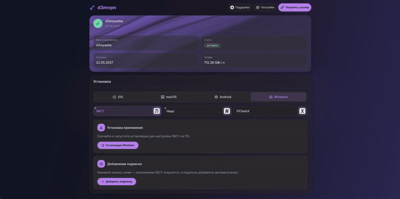
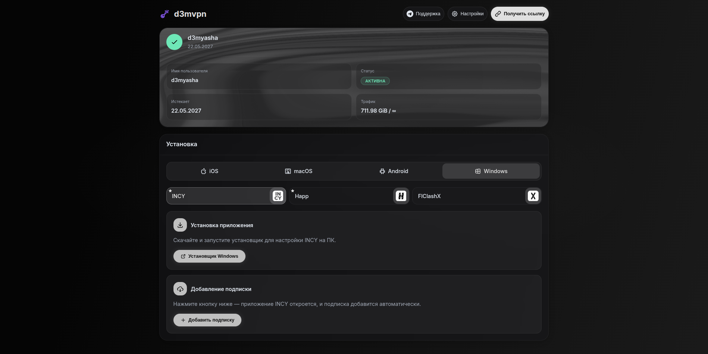
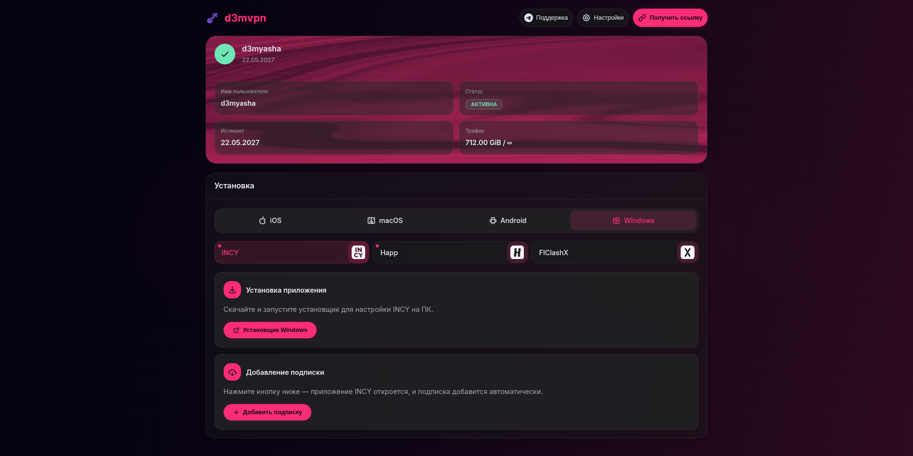
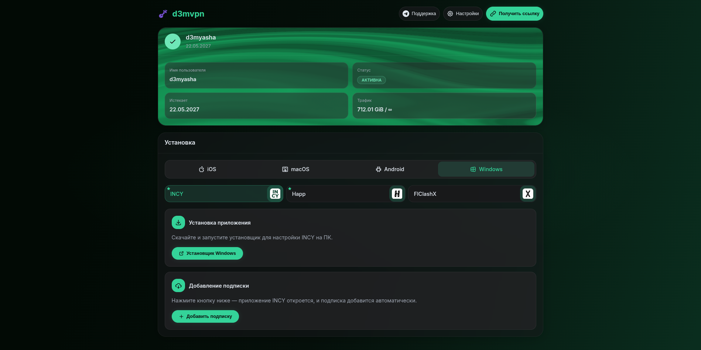
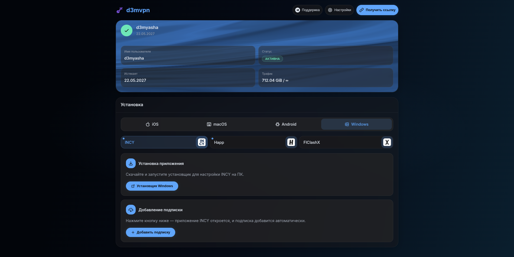

<p align="center">
  
</p>

<h1 align="center">Remna Reiwa Subpage</h1>

<p align="center">
  <b>Subscription information page for <a href="https://remnawave.xyz">RemnaWave</a> panel</b><br>
  Доработанная страница подписки с WebGL2 warp-шейдером, адаптивным дизайном и тёмной темой.
</p>

<p align="center">
  
</p>

<p align="center">
  <b>⚡ Быстрая установка:</b>
  <code>curl -L -s -O https://raw.githubusercontent.com/d3myasha/Remna-Reiwa-Subpage/main/setup.sh && bash setup.sh</code>
</p>

---

## ✨ Features

- **WebGL2 Warp Effect** — динамический шейдерный фон на карточке пользователя (портирован с @paper-design/shaders)
- **Subscription Info** — статус, срок действия, трафик, имя пользователя
- **QR Code** — быстрая ссылка на подписку
- **Application Guides** — встроенные инструкции по настройке для всех платформ
- **Responsive** — адаптивная вёрстка, работает на мобильных
- **Multi-language** — поддержка нескольких языков

---

## 🎨 Темы

| Purple | Monochrome |
|---|---|
|  |  |

| Cyberpunk | Emerald |
|---|---|
|  |  |

| Amber | Ocean |
|---|---|
|  |  |

---

## 🚀 Установка

Скрипт установки скачает index.html, предложит выбрать язык и тему:

```bash
curl -L -s -O https://raw.githubusercontent.com/d3myasha/Remna-Reiwa-Subpage/main/setup.sh && bash setup.sh
```

Или одной строкой (неинтерактивно, с выбором темы сразу):

```bash
curl -L -s -O https://raw.githubusercontent.com/d3myasha/Remna-Reiwa-Subpage/main/setup.sh && bash setup.sh -t 3
```

Где `-t` — номер темы (1-6).

Или вручную: скачай файл в директорию подписки:

```bash
# Через wget
wget -O /opt/remnawave/subscription/index.html https://raw.githubusercontent.com/d3myasha/Remna-Reiwa-Subpage/main/index.html

# Или через curl
curl -L -o /opt/remnawave/subscription/index.html https://raw.githubusercontent.com/d3myasha/Remna-Reiwa-Subpage/main/index.html
```

После скачивания структура будет такой:

```
/opt/remnawave/subscription/
├── docker-compose.yml
├── .env
└── index.html
```

2. Volume mount в `docker-compose.yml` (или проверь что он уже есть):

```yaml
volumes:
  - ./index.html:/opt/app/frontend/index.html
```

3. Перезапусти контейнер:

```bash
docker compose restart remnawave-subscription-page
```

> Страница использует серверный рендеринг (`<%= ... %>`), поэтому работает только в связке с RemnaWave.

---

## 🎨 Кастомизация через скрипт

Скрипт `setup.sh` поддерживает готовые темы оформления. Запуск:

```bash
bash setup.sh                  # интерактивный режим: выбор языка и темы
bash setup.sh -t 3            # неинтерактивно: тема Cyberpunk
bash setup.sh -t 2 -l ru      # тема Monochrome + русский язык
```

### Доступные темы

| № | Тема | Акцент | Фон |
|---|---|---|---|
| `1` | **Default (Purple)** | `#c084fc` фиолетовый | тёмный градиент |
| `2` | **Monochrome** | `#e0e0e0` серый | чёрно-серый |
| `3` | **Cyberpunk** | `#ff2d78` розовый + `#00d4ff` голубой | тёмный неон |
| `4` | **Emerald** | `#34d399` изумрудный | тёмно-зелёный |
| `5` | **Amber** | `#f59e0b` янтарный | тёмный тёплый |
| `6` | **Ocean** | `#60a5fa` синий | тёмно-синий |

Скрипт меняет:
- Акцентный цвет (`--primary-color`)
- Фон страницы (градиент + свечение)
- Цвета warp-эффекта
- Meta theme-color

---

## ⚙️ Параметры Warp-эффекта

Эффект настраивается в вызове `initWarpEffect()` в `index.html`:

| Параметр | По умолчанию | Описание |
|---|---|---|
| `speed` | `0.8` | Скорость анимации |
| `proportion` | `0.55` | Пропорция смешивания цветов |
| `distortion` | `0.12` | Сила искажения шума |
| `swirl` | `1.0` | Интенсивность завихрений |
| `swirlIterations` | `13` | Количество итераций завихрения |
| `shape` | `1` | Тип узора (0=клетка, 1=полосы, 2=край) |
| `softness` | `0.8` | Мягкость цветовых переходов |
| `colors` | — | Массив цветов в формате `[R, G, B]` |

---

## 📄 Лицензия

MIT
