# 🎨 Темы оформления

### 1. Purple

| Тёмная | Светлая |
|:------:|:-------:|
| 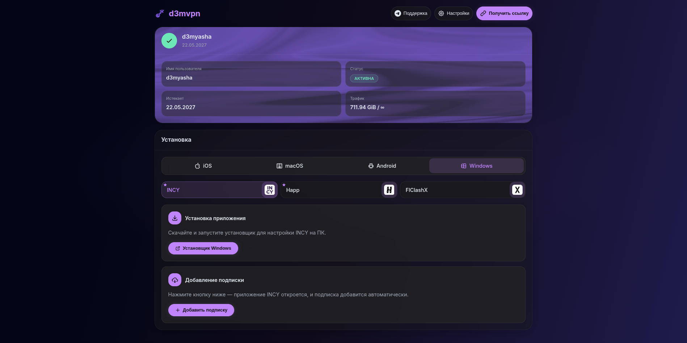 | 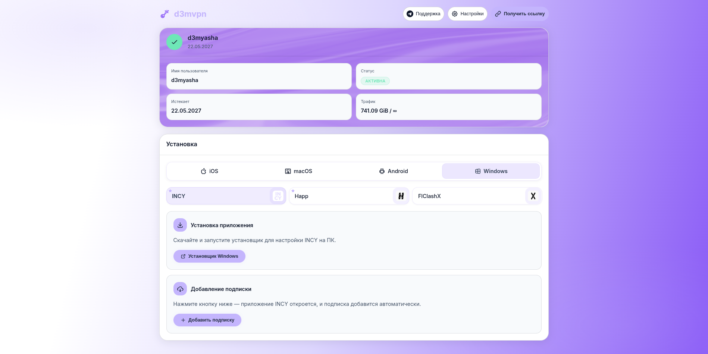 |

### 2. Monochrome

| Тёмная | Светлая |
|:------:|:-------:|
|  | 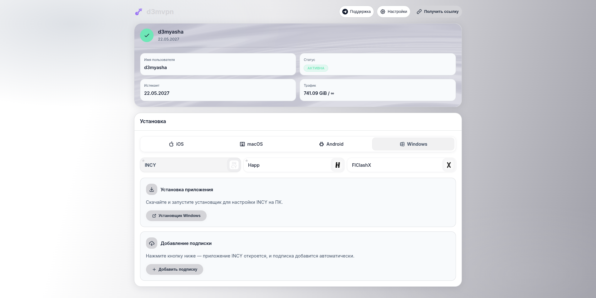 |

### 3. Cyberpunk

| Тёмная | Светлая |
|:------:|:-------:|
|  | 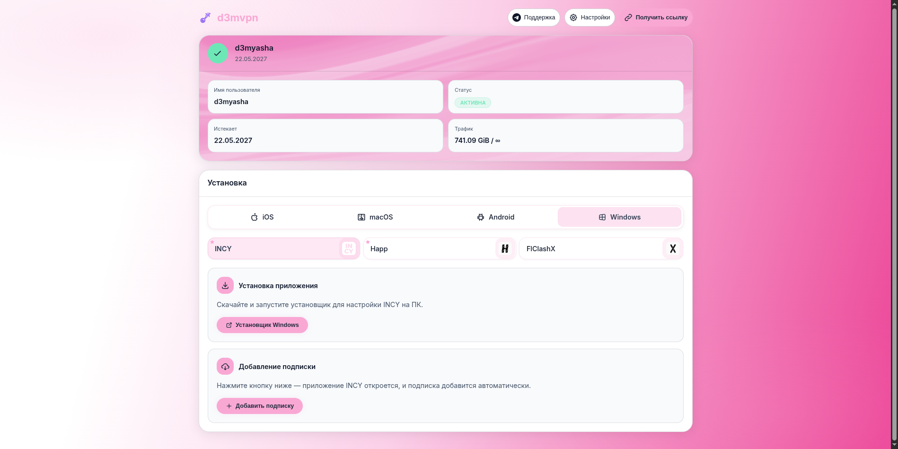 |

### 4. Emerald

| Тёмная | Светлая |
|:------:|:-------:|
|  | 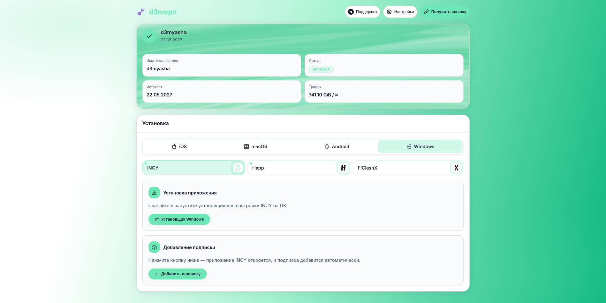 |

### 5. Amber

| Тёмная | Светлая |
|:------:|:-------:|
| 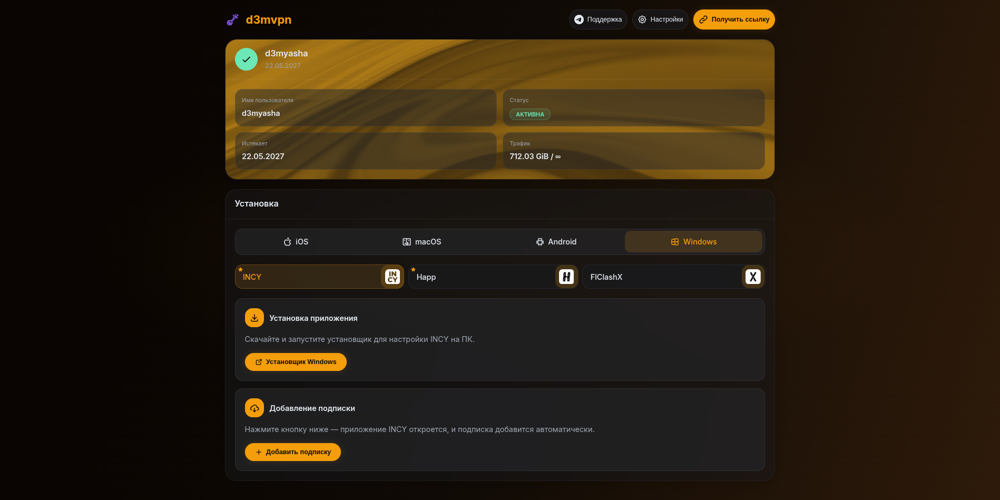 | 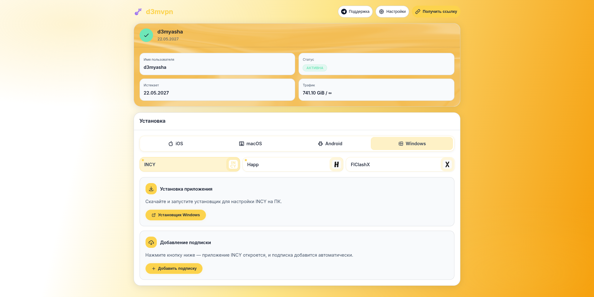 |

### 6. Ocean

| Тёмная | Светлая |
|:------:|:-------:|
|  | 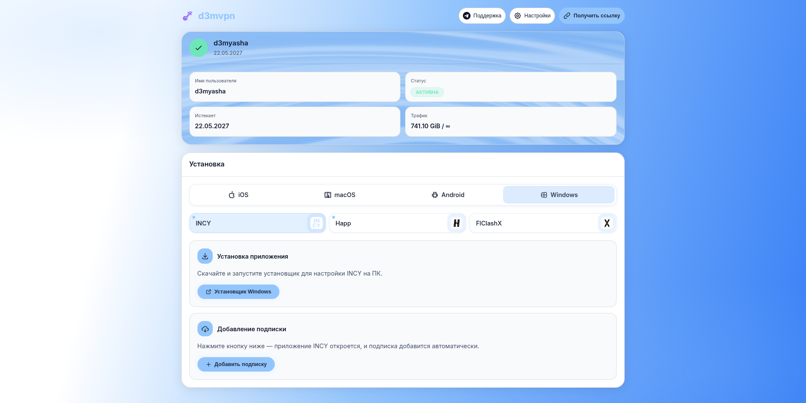 |

### 7. Blush

| Тёмная | Светлая |
|:------:|:-------:|
| 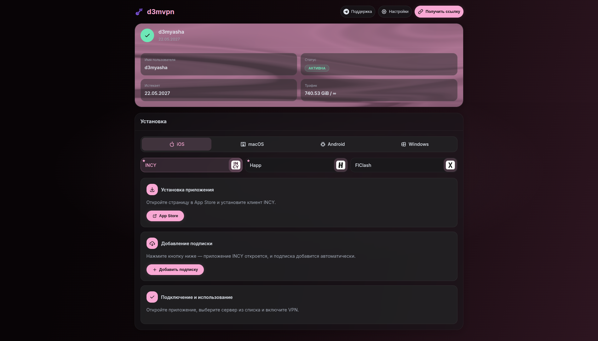 | 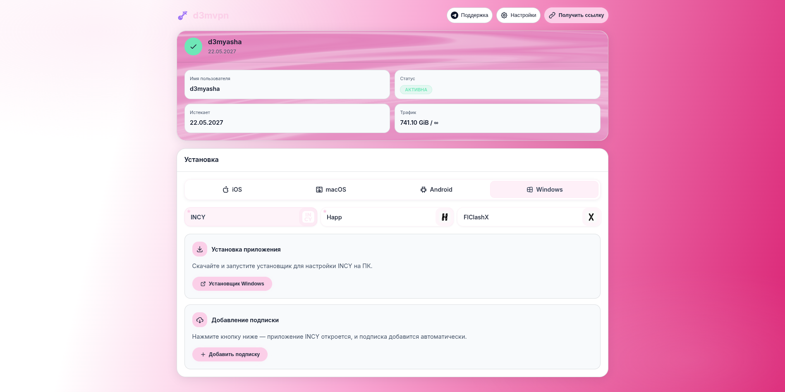 |

### 8. Red

| Тёмная | Светлая |
|:------:|:-------:|
| 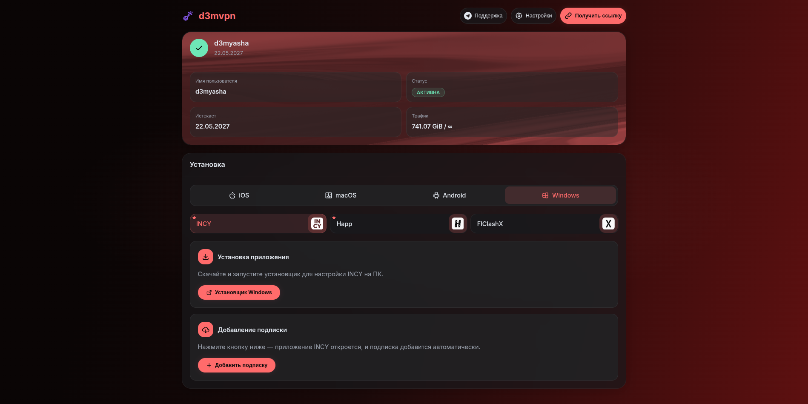 | 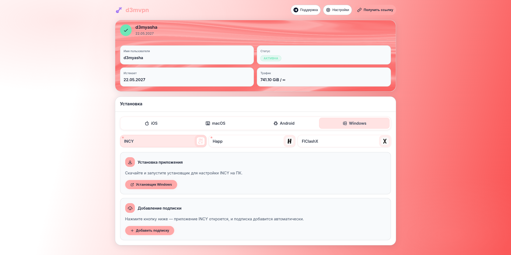 |

### 9. Grape

| Тёмная | Светлая |
|:------:|:-------:|
| 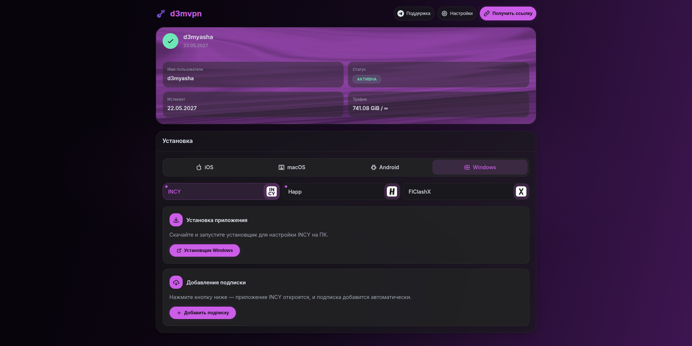 | 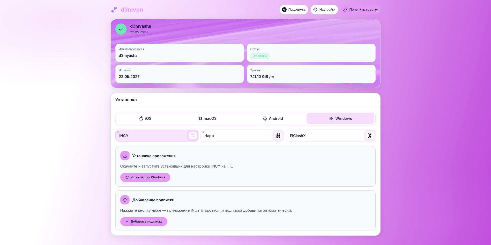 |

### 10. Teal

| Тёмная | Светлая |
|:------:|:-------:|
| 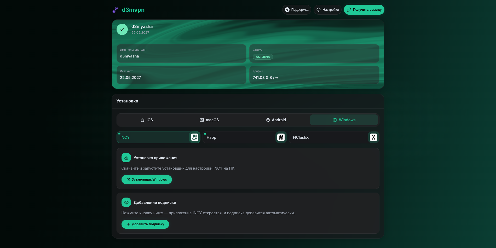 | 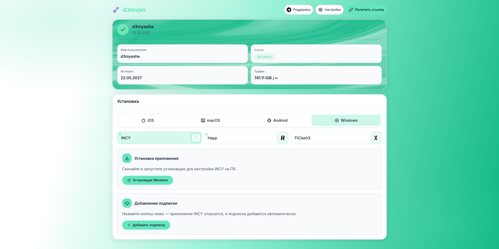 |

### 11. Yellow

| Тёмная | Светлая |
|:------:|:-------:|
| 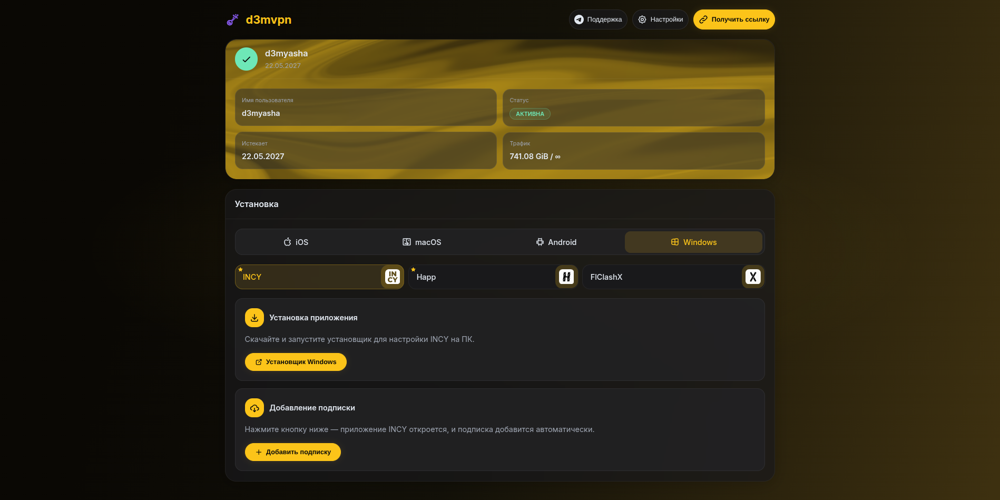 | 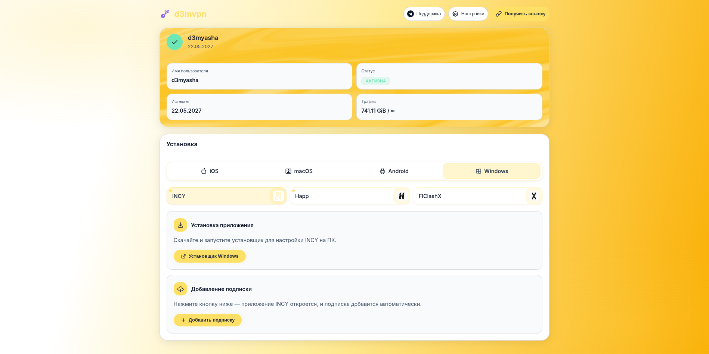 |